# 로드밸런서란?
로드밸런서는 서버의 과부하를 방지하기 위해 여러 대의 서버나 서비스 인스턴스에 트래픽을 고르게 분배하여 서비스의 가용성과 성능을 보장하는 장치 또는 소프트웨어이다. 로드밸런서가 없다면 특정 서버에 트래픽이 집중되어 서버가 다운되거나 응답 속도가 급격히 저하될 수 있다. 이를 통해 어플리케이션의 가용성을 높이고, 사용자 경험을 향상시키며, 인프라 리소스의 효율적인 사용을 가능하게 해준다.

로드밸런서는 클라이언트의 요청을 받아 적절한 백엔드 서버로 전달하는데, 백엔드 서버의 상태를 지속적으로 모니터링하고, 장애가 발생한 서버로 트래픽을 보내지 않도록 조정하여 서비스의 안정성을 유지한다. 또한, 로드밸런서는 SSL/TLS 암호화를 해제하거나, 세션 관리를 통해 사용자에게 일관된 서비스를 제공하는 역할도 수행한다.

앞서 트래픽을 분배한다는 이야기를 했는데, 이는 클라이언트의 요청을 특정 서버로 라우팅하는 것을 의미한다. 로드밸런서는 다양한 알고리즘을 사용하여 분산 전략을 설정할 수 있는데, 대표적인 예로 라운드 로빈, 최소 연결, IP 해시 방식 등이 있다. 각 알고리즘은 동작하는 방식 및 목적이 다르므로 자신의 상황에 맞게 적절한 알고리즘을 사용하면 된다.

## 로드밸런싱 알고리즘
로드밸런싱 알고리즘은 서버에 들어오는 트래픽을 효율적으로 분산시키기 위해 사용되는 다양한 방법을 의미한다. 적절한 알고리즘을 선택함으로써 서버의 부하를 균형 있게 분산하고, 응답 시간을 최소화하며, 전체 시스템의 성능을 향상시킬 수 있다.
### 라운드 로빈
순차적으로 요청을 서버에 분산하여, 모든 서버가 균등한 양의 트래픽을 처리하도록 한다.
### 최소 연결
현재 연결된 클라이언트 수가 가장 적은 서버로 트래픽을 분산하여, 서버 자원의 균형을 유지한다.
### IP 해시
클라이언트의 IP 주소를 해싱하여 특정 서버로 매핑한다. 이를 통해 특정 클라이언트가 항상 동일한 서버로 연결될 수 있도록 보장한다.

이 외에도 수많은 방법이 있으며 자신의 상황에 맞게 적절하게 사용하면 된다.

# 로드밸런서의 유형
## 하드웨어 vs 소프트웨어
로드밸런서는 하드웨어와 소프트웨어 두 가지 형태로 나눌 수 있다. 하드웨어 로드밸런서는 물리적 장치로 구현되며, 높은 성능을 제공하지만 초기 비용이 비싸고 확장이 어렵다는 단점이 있다. 반면, 소프트웨어 로드밸런서는 서버 또는 클라우드 환경에서 구현할 수 있어 초기 비용이 저렴하고 확장성이 뛰어나다. 내가 해당 글에서 설명할 AWS에서 제공하는 ELB는 대표적인 소프트웨어 기반 로드밸런서이다.

## L4 vs L7
L4(Transport Layer) 로드밸런서는 IP 및 포트 정보를 기반으로 트래픽을 분산시킨다. 속도와 효율성이 뛰어나지만 세션 유지 및 특정 경로 기반 라우팅 등의 고급 기능을 제공하지 않는다. 반면, L7(Application Layer) 로드밸런서는 HTTP/S, URL 패턴, 쿠키 등의 정보를 기반으로 라우팅을 수행하며, 더욱 복잡한 분산 전략을 구현할 수 있다.

# 로드밸런서의 주요 기능
## 세션 유지 및 쿠키 기반 라우팅
세션 유지는 클라이언트가 동일한 세션 동안 항상 같은 서버에 연결되도록 보장하는 기능이다. 이 기능은 사용자 인증 정보나 장바구니 상태와 같은 세션 데이터를 서버 간 공유하지 않을 때 유용하다. 쿠키 기반 라우팅은 특정 쿠키 값을 기준으로 클라이언트를 특정 서버로 연결시켜, 세션 유지와 사용자에게 일관된 경험을 제공한다.

## 헬스 체크
헬스 체크는 로드밸런서가 주기적으로 백엔드 서버의 상태를 점검하는 기능이다. 특정 서버가 비정상일 경우, 헬스 체크를 통해 해당 서버를 트래픽 분산 대상에서 제외하고, 자동으로 장애 조치를 수행하여 정상 서버만 트래픽을 처리하도록 한다.

## SSL/TLS 종료
로드밸런서는 SSL/TLS 종료를 지원하여 백엔드 서버가 암호화된 트래픽을 처리하지 않도록 할 수 있다. 이를 통해 백엔드 서버의 부담을 줄이고, 중앙에서 SSL/TLS 인증서를 관리하여 보안성을 높일 수 있다.

# AWS ELB
AWS ELB(Elastic Load Balancing)는 AWS에서 제공하는 로드밸런서이다. ELB는 다양한 네트워크 계층 (Layer 4/7)에서 트래픽을 분산시킬 수 있어, 인프라의 복잡성을 줄이고 확장성을 높인다. 또한, AWS의 Auto Scaling 및 다양한 서비스와의 연동을 통해 트래픽 급증에 자동으로 대응할 수 있는 유연성을 제공한다.

ELB의 주요 구성 요소로는 대상 그룹(Target Group), 청취자(Listeners), 규칙(Rules)가 있다. 대상 그룹은 트래픽을 분배할 서버 집합을 정의하며, 청취자는 특정 포트의 인바운드 요청을 수신하고, 규칙은 특정 조건에 따라 트래픽을 라우팅한다.

# ELB 직접 구현하며 배우기
이제 AWS ELB를 직접 만들어보면서 하나씩 알아보자.
아래는 내가 참여한 코드잽 프로젝트의 서버 구상도이다.
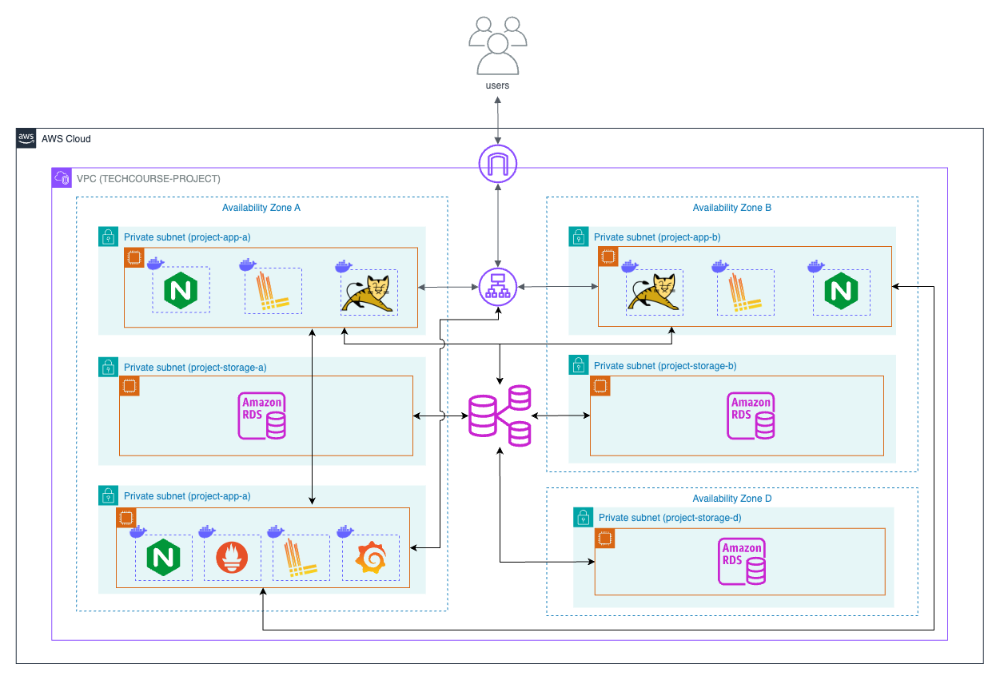

복잡해보이지만, RDS를 제외하고 2개의 서버 인스턴서와 좌측 하단에 있는 모니터링 인스턴스만 생각해보자.
나는 서버 url을 입력하면 2개의 서버 인스턴스 중 한 곳으로 가고 싶고, 모니터링 url을 입력하면 모니터링 인스턴스로 이동하고 싶다. 또한, HTTPS 트래픽을 처리하고 싶다.
## HTTPS 및 보안 설정
### SSL/TLS 인증서 구성 및 적용
AWS ELB를 통해 HTTPS 트래픽을 처리하기 위해서는 SSL/TLS 인증서를 구성해야 한다. 인증서는 ACM(AWS Certificate Manager)를 통해 무료로 생성 및 관리할 수 있으며, ELB에서 HTTPS 청취자를 설정할 때 해당 인증서를 적용하면 된다. 이를 통해 데이터 전송 과정에서의 보안성을 높일 수 있다.

AWS 콘솔 창에서 ACM을 검색 후 인증서 요청을 클릭하여 퍼블릭 인증서를 요청해보자.
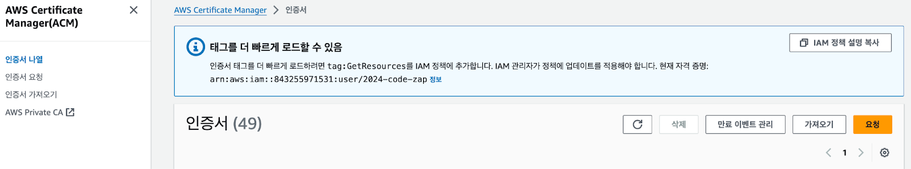

다음과 같은 화면 이 나오는데 도메인 이름에는 SSL 이용해 암호화 하고자 하는 도메인을 입력한다.
코드잽의 주소는 www.code-zap.com이므로 이 주소를 입력해주었다. 추가적으로 code-zap.com만 입력해도 사용할 수 있게 하고 싶어서 code-zap.com을 추가해주었고, 모니터링 등 다양한 도메인도 SSL을 이용하고 싶어 *.code-zap.com도 추가해주었다. 검증 방법은 DNS 와 이메일 검증이 있는데 DNS 검증을 추천한다. 다만 DNS 인증을 이용하기 위해서는 www.code-zap.com 이 DNS 서버에 등록이 되어있어야 한다. DNS 서버에 domain 을 등록 하는 방법은 따로 다루지 않겠다.

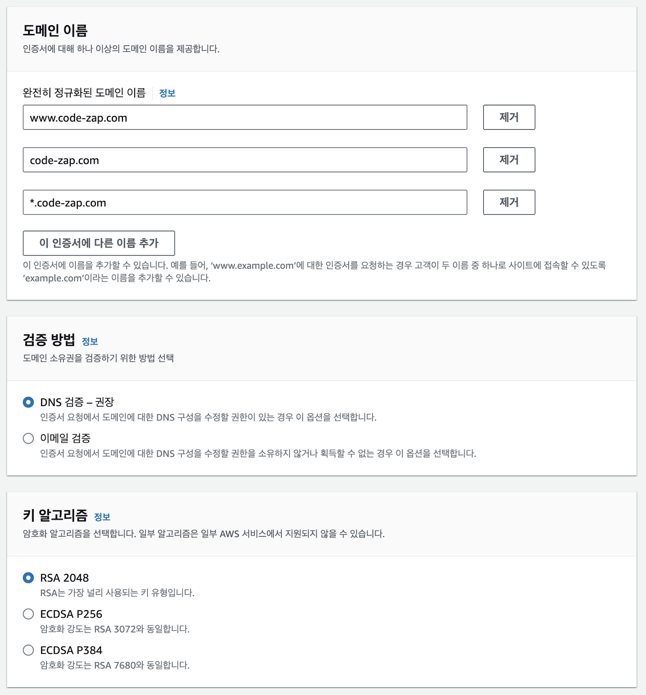

설정을 모두 완료하고 요청을 누르면 인증서가 생성된다. 처음에는 검증 대기중이라고 나오는데, 검증이 완료되면 발급됨 상태로 변경된다. 이렇게 되면 인증서를 사용할 수 있다.

## 대상 그룹(Target Group) 구성
다음으로 대상 그룹을 생성해보자. 대상 그룹은 로드밸런서가 트래픽을 분배할 백엔드 인스턴스나 IP 주소의 집합을 정의한다. 대상 그룹의 헬스 체크 및 라우팅 규칙을 설정하여 트래픽이 적절한 대상에 전달되도록 구성할 수 있다.
AWS 콘솔 창에서 대상 그룹을 검색 후 대상 그룹을 생성해보자. 나의 경우 ec2 인스턴스에 요청을 라우팅하는 것이 목적이므로 target type을 인스턴스로 선택했다.

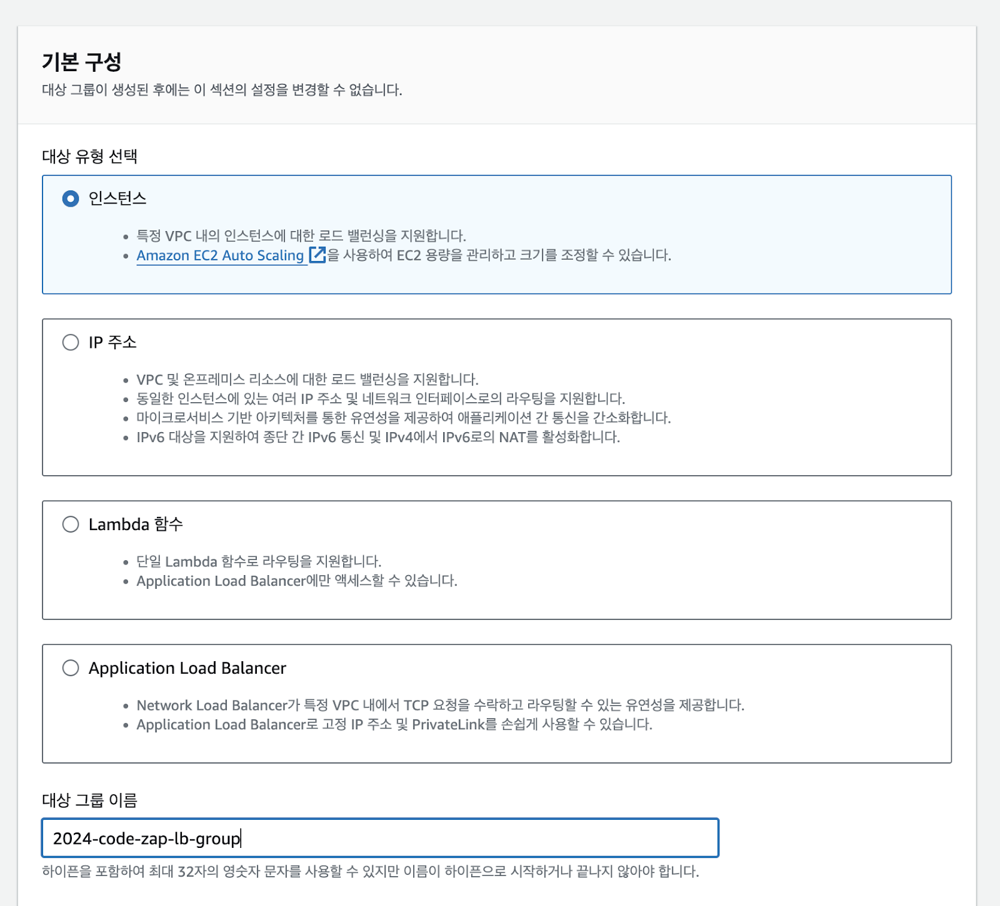

프로토콜 : 포트는 대상 그룹에 소속된 EC2들이 받을 프로토콜과 포트이다. 예를 들어 HTTP:80으로 설정하면 이 대상그룹에 소속된 EC2들은 80 포트로 설정된 요청만을 받아들인다는 의미이다. VPC는 우아한테크코스에서 제공해주는 VPC를 사용하였다.
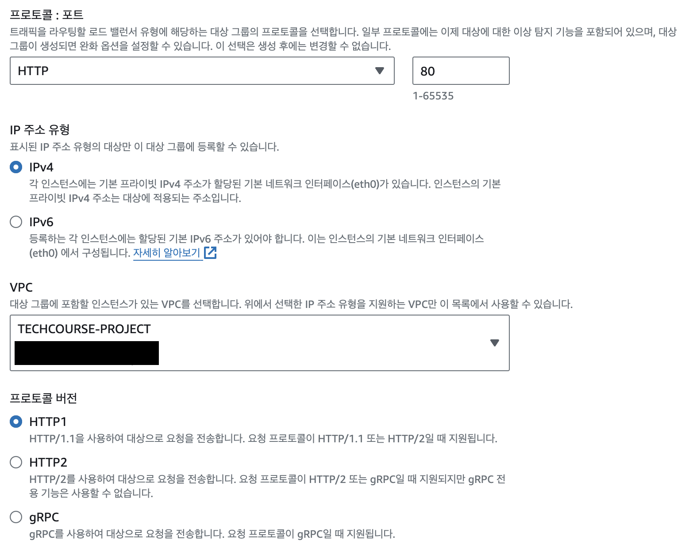

나는 현재 스프링에서 actuator를 사용중이기 때문에 /actuator/health 경로로 헬스 체크를 진행하였다.

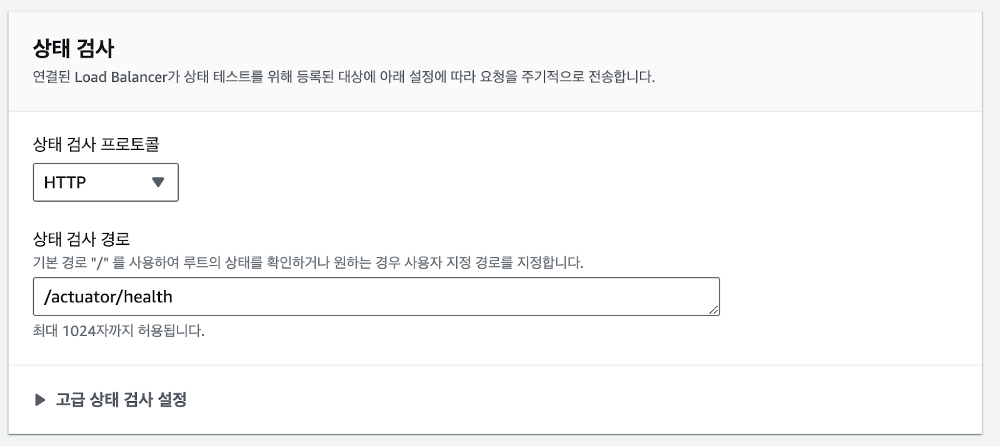

마지막으로 생성한 대상 그룹에 요청을 처리할 EC2 인스턴스를 추가해야 한다. 추가하고자 하는 EC2 인스턴스를 선택하고 해당 인스턴스의 어떤 포트로 라우팅할 지 정하면 된다. 나는 2개의 서버 인스턴스에 80번 포트로 요청을 라우팅하도록 설정하였다.
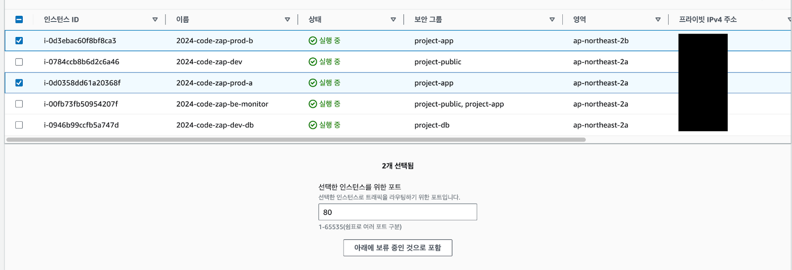

추가적으로, 나는 모니터링 서버로 이동하는 것도 로드밸런서를 사용하고 싶기 때문에 모니터링 인스턴스를 추가한 대상 그룹도 하나 생성하였다.
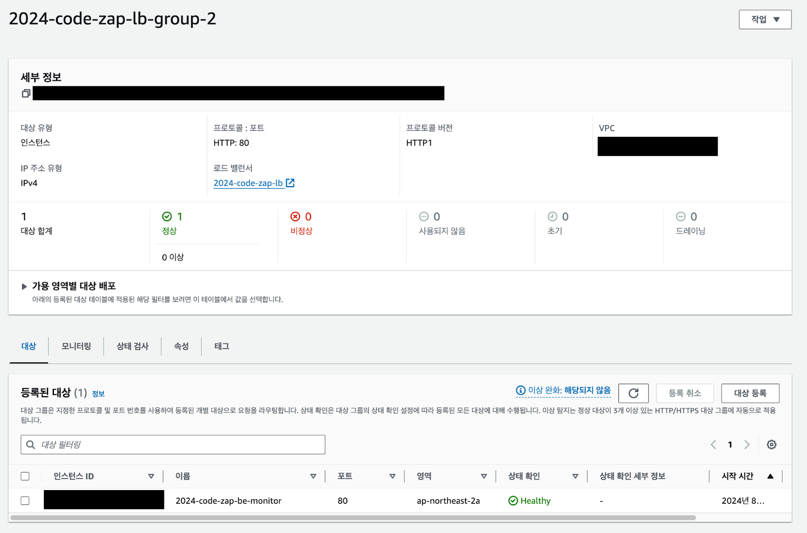

## AWS ELB 생성
이제 AWS ELB를 생성해보자. AWS Management Console이나 CLI(Command Line Interface)를 사용하여 ELB를 손쉽게 설정할 수 있다. AWS 콘솔 창에서 ELB 또는 로드밸런서를 검색 후 로드밸런서를 생성해보자.

### AWS ELB의 종류와 비교
로드밸런서 생성을 누르면 아래와 같은 화면이 보인다. 각각의 유형에 대한 설명은 다음과 같다.
- ALB(Application Load Balancer)
  - ALB는 L7 로드밸런서로, HTTP/S 트래픽의 정교한 라우팅을 지원하며, URL 경로 기반 라우팅, 호스트 기반 라우팅, WebSocket 지원 등 고급 기능을 제공한다.
- NLB(Network Load Balancer)
  - NLB는 L4 로드밸런서로, TCP/UDP 트래픽의 빠른 분산을 지원하며, 대규모 트래픽 처리와 낮은 지연 시간을 필요로 하는 어플리케이션에 적합하다.
- GLB(Gateway Load Balance)
  - GLB는 네트워크 보안 장치와 같은 서비스형 장치를 연결하고 트래픽을 분산시킬 때 사용된다.
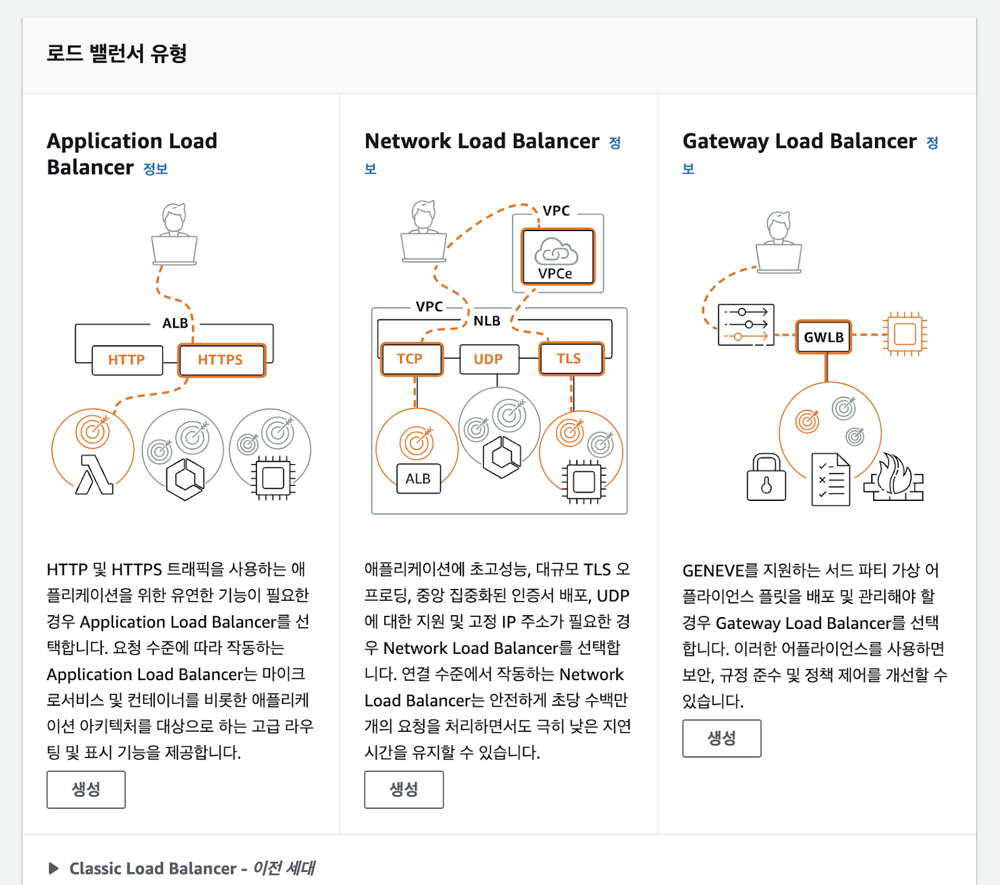

각 로드밸런서는 트래픽의 특성과 어플리케이션 요구사항에 따라 선택해야 한다. 예를 들어, HTTP 기반 웹 어플리케이션이라면 ALB를, 높은 성능과 낮은 지연 시간이 중요한 서비스라면 NLB를 사용하는 것이 좋다. 나는 HTTP 기반 웹 어플리케이션 프로젝트를 진행하였으므로 ALB를 사용하였다.

### Basic Configuration
로드 밸런서 이름 지정 및 Scheme와 IP 주소 타입을 결정한다. 외부 요청에 대해 각 서브넷으로 로드 밸런싱을 수행할 것이기 때문에 인터넷 경계(Internet-facing)을 선택하였다.
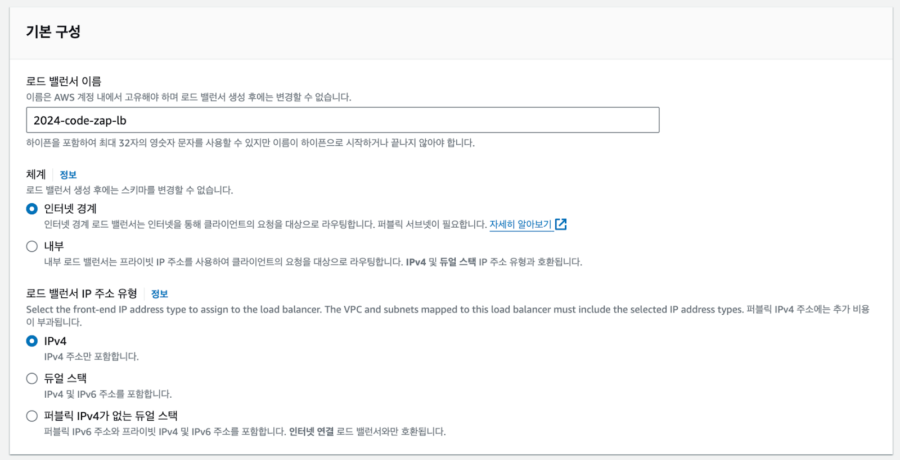

### Network Mapping
로드 밸런서를 둘 VPC를 선택하고 로드밸런싱을 수행할 서브넷을 선택한다. 나는 우아한테크코스에서 제공해주는 VPC를 사용하였고, 서로 다른 두 개의 가용 영역에 로드밸런서를 배치하고 외부에서 접근할 수 있게 public subnet을 선택하였다.
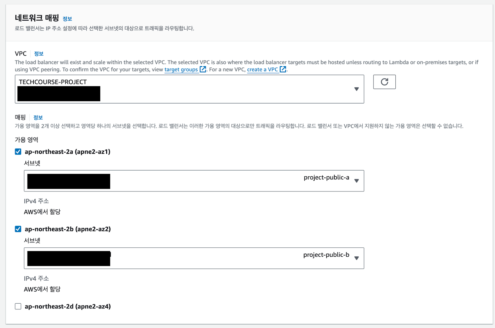

### Security Group & Listeners and Routing
Security Group(보안그룹)은 임의의 protocol과 port로의 요청을 어떻게 처리할 것인지에 대한 규정을 담고 있다. ec2 인스턴스와 동일한 정책을 사용하기 위해서는 ec2 인스턴스에 할당한 보안그룹을 선택해도 된다. 나는 우아한테크코스에서 제시간대로 project-public을 사용하였다.

Listeners and Routing은 생성중인 ALB 가 몇번 port로 들어오는 어떤 protocol의 요청을 어떻게 처리 할지 설정하는 것이다. 나는 80번 포트로 들어오는 http 요청과 443 번 포트로 들어오는 https 요청에 대해 기본 작업으로 이전에 생성한 2024-code-zap-lb-group으로 요청을 포워딩하도록 설정하였다. 하지만 이렇게 설정해 놓으면 80번 포트로 들어오는 비암호화된 요청이 들어오게 되므로 뒤에서 80번 포트로 들어오는 http 요청에 대한 라우팅 정책을 변경 할 것이다.

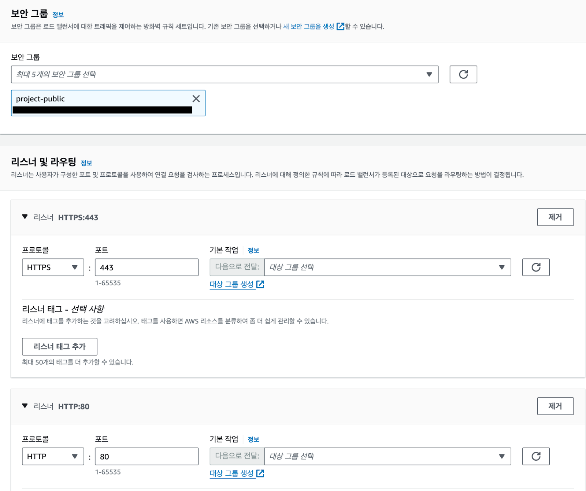

### Secure listener settings
보안 리스너는 앞서 ACM에서 발급받은 SSL 인증서를 선택하면 된다. 이렇게 설정하면 ALB가 SSL 통신의 종단점 역할을 수행할 수 있게 된다.
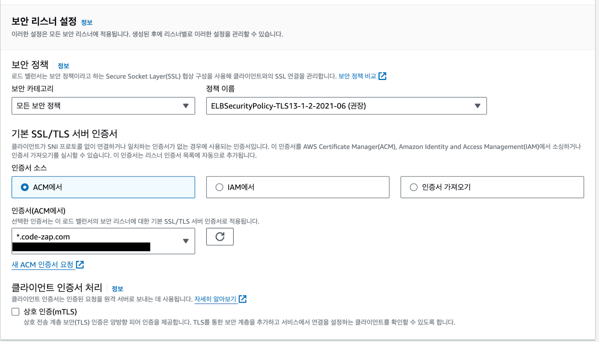

이제 로드밸런서 생성을 완료하였다. 마지막으로 listener와 rules를 설정하여 로드밸런서가 우리가 원하는대로 동작하도록 설정해보자.

### 청취자(Listeners)와 규칙(Rules) 설정
listeners는 로드밸런서가 수신할 포트 및 프로토콜을 정의한다.
앞서 나는 80번 포트로 들어오는 HTTP 요청과 443번 포트로 들어오는 HTTPS 요청을 모두 우리가 생성한 대상 그룹으로 포워딩하게 설정해주었다. 하지만 나는 80번 포트로 들어노는 HTTP 요청은 HTTPS 요청으로 redirect 하고 싶다. 이를 위해서는 설정을 변경해주어야 한다.

생성한 로드밸런서를 클릭하여 리스너를 아래와 같이 수정해보자.
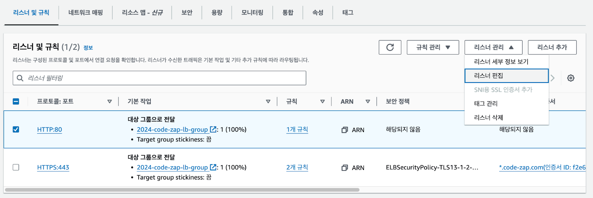
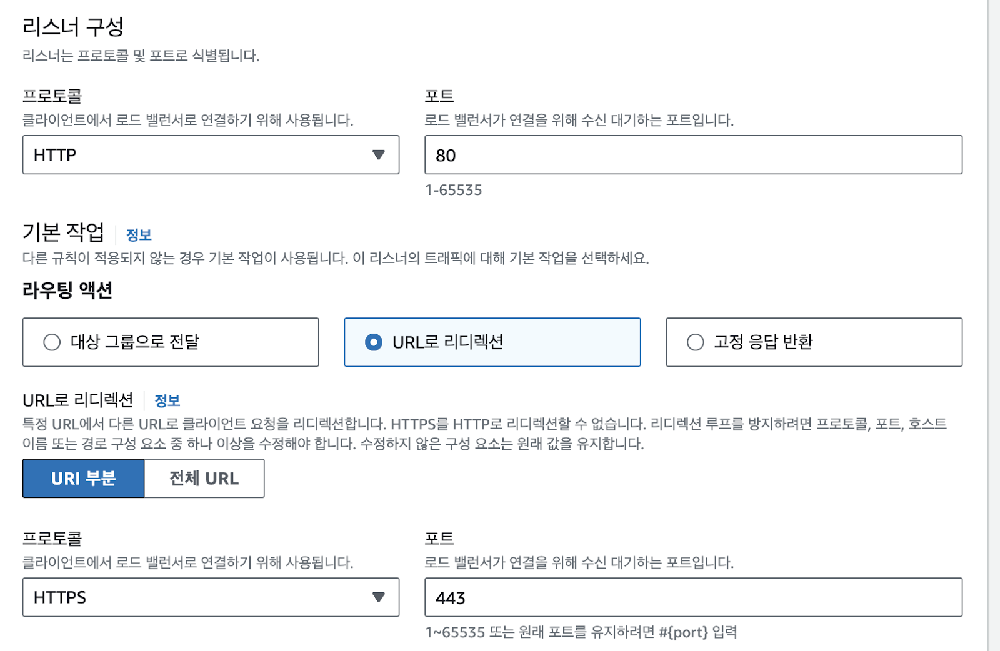
이렇게 하면 80번 포트로 들어오는 요청은 443번 포트의 HTTPS로 redirect 되게 된다.

추가적으로 현재는 서버 인스턴스로만 접근할 수 있다. 하지만 나는 모니터링 url을 입력하면 모니터링 서버로 포워딩되도록 하고 싶다. 그럴 때 사용하는 것이 rule 설정이다. rule은 특정 조건에 따라 트래픽을 라우팅한다. 예를 들어, URL 패턴이 `/api/*`인 요청을 특정 대상 그룹으로 전달하도록 설정할 수 있다.
이번에는 443번 HTTPS 요청에 대한 규칙을 추가해보자.
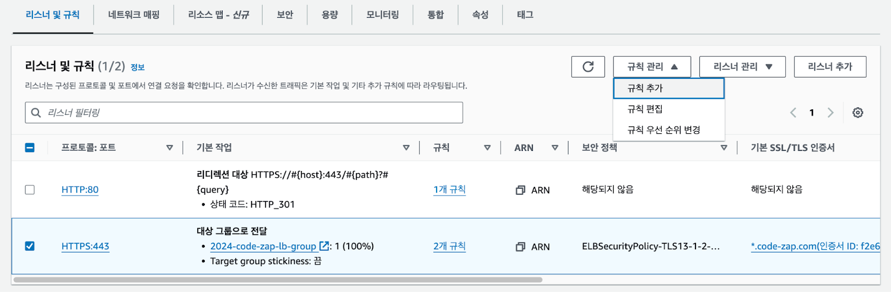
해당 규칙의 이름을 설정할 수 있다. 모니터링에 대한 규칙이므로 monitor로 설정하였다.
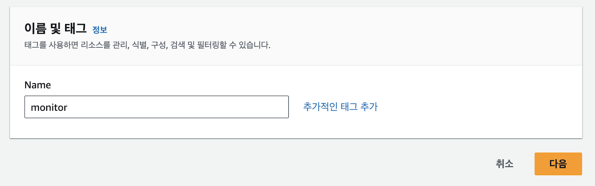

만약 모니터링 url로 접근하게 되면, 즉 호스트 헤더가 모니터링 url이라면 해당 규칙을 적용한다.
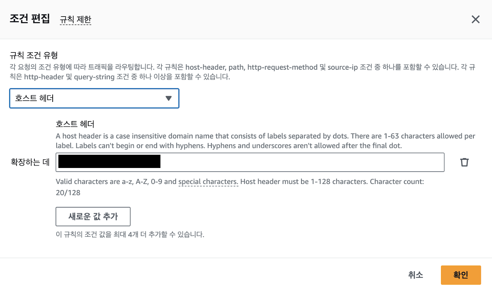

이 규칙이 적용되게 된다면 기존에 설정해놓은 서버 인스턴스들이 존재하는 대상 그룹이 아닌 모니터링 인스턴스가 존재하는 대상 그룹으로 포워딩되도록 한다.
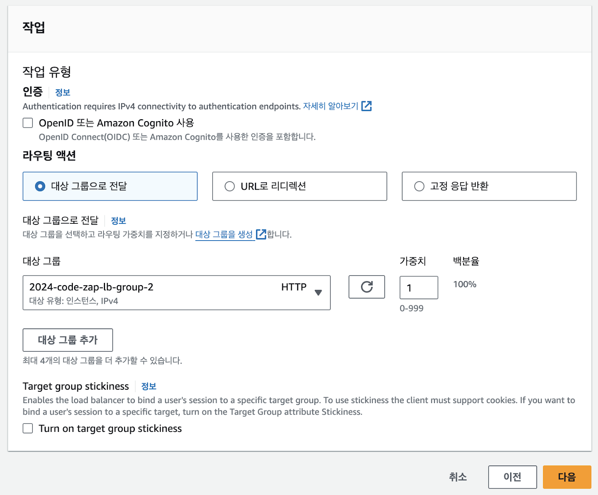
설정을 완료하면 다음과 같이 2개의 규칙이 적용되어 있는 것을 확인할 수 있다.
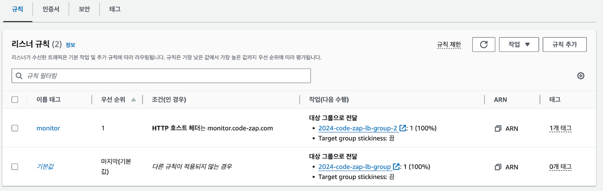

이제 우리는 서버 url을 입력하면 서버 인스턴스로 요청을 보낼 수 있고, 모니터링 url을 입력하면 모니터링  서버로 요청을 보낼 수 있게 되었다.

# 결론
AWS ELB는 웹 애플리케이션의 가용성과 성능을 향상시키는 데 매우 중요한 역할을 한다. 로드밸런서를 통해 트래픽을 효율적으로 분산하고, 백엔드 인스턴스의 상태를 모니터링하여 서비스의 안정성을 높일 수 있다. 또한, 보안 및 SSL/TLS 관리, 다양한 라우팅 전략을 통해 효율적인 트래픽 관리를 실현할 수 있다. 이번 포스트를 통해 AWS ELB의 다양한 기능과 설정 방법을 이해하고, 이를 실제 애플리케이션에 적용해보길 바란다.

